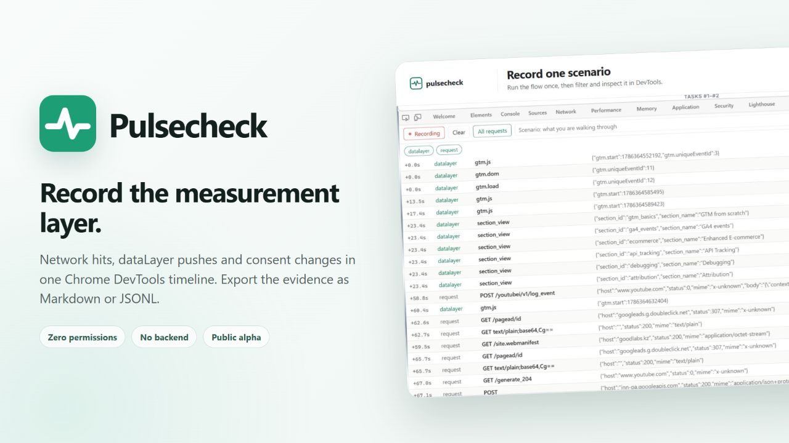
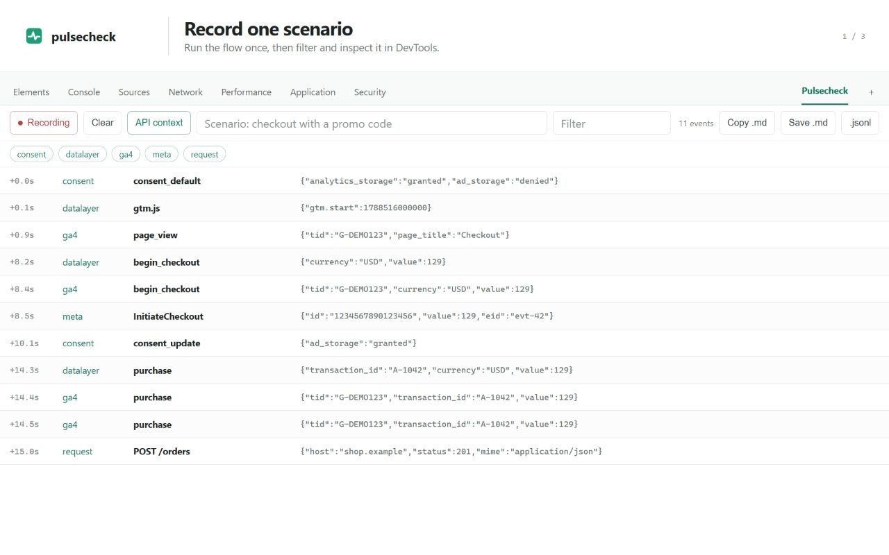
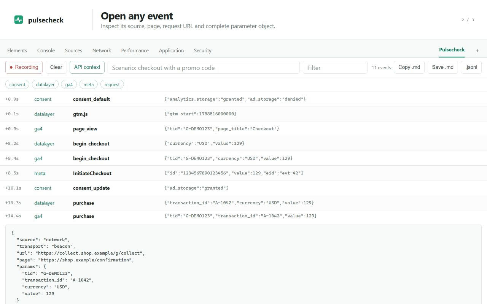
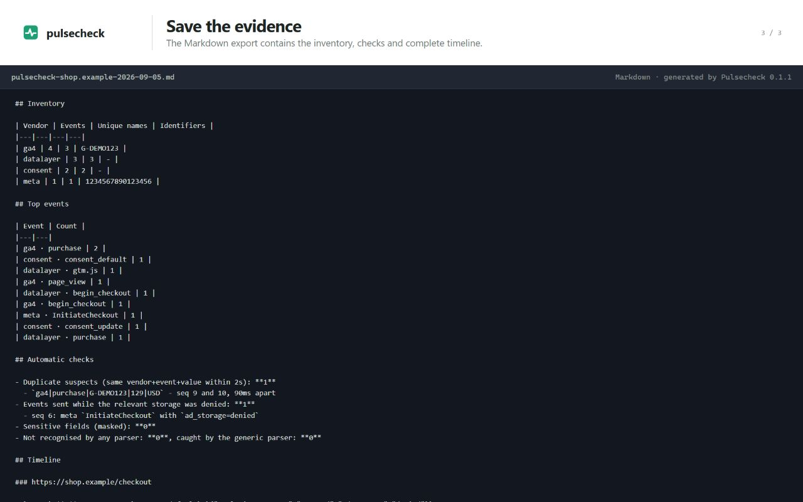

<p align="center">
  
</p>

# Pulsecheck

[](https://github.com/arcbaslow/pulsecheck/actions/workflows/test.yml)

Pulsecheck is a Chrome DevTools extension for recording tracking sessions. It
puts network hits, `dataLayer` pushes and consent changes in one timeline, then
exports the session as Markdown or JSONL.

The Markdown file is the main output. It contains enough context to review the
session by hand or give it to an LLM: scenario, vendors, checks, parameters and
the full event order.

> Status: alpha. The Chrome Web Store package is prepared but not submitted.



## Install

There is no build step. Download and extract the
[latest release](https://github.com/arcbaslow/pulsecheck/releases/latest), or
clone the repository.

1. Open `chrome://extensions`.
2. Enable **Developer mode**.
3. Click **Load unpacked** and select the `extension/` directory.
4. Open DevTools on a normal website and select **Pulsecheck**. The tab may be
   behind `»`.

If DevTools was open when the extension was installed or reloaded, close and
reopen it. DevTools extensions do not run on `chrome://` pages, the New Tab page
or the Chrome Web Store.

The manifest requests no extension permissions.

## Use

1. Open the panel before starting the flow you want to test.
2. Enter a short scenario name, such as `checkout with a promo code`.
3. Walk through the flow.
4. Inspect or filter the recorded events.
5. Save the Markdown file, copy it, or export JSONL.

Recording starts when the panel opens and ends when DevTools closes. Optional
**API context** adds the method, host, path, status and MIME type for non-static
site requests. It excludes request bodies and query strings. Context rows are
not counted as tracking events or duplicates.



## Captured data

- Network requests sent with fetch, XHR, `sendBeacon` or pixels.
- GA4, including batched hits, regional endpoints and custom-domain sGTM.
- Meta Pixel, Yandex Metrica, Amplitude and TikTok.
- Event-shaped first-party collectors through a generic fallback.
- Existing and new `dataLayer` pushes, including custom names containing
  `dataLayer`, plus `digitalData`.
- Google Consent Mode defaults and updates.
- Page changes during the session.

Unknown event-shaped traffic is kept as `generic`. If a matched parser throws,
the request is kept as `unparsed` rather than discarded.

## Output

`pulsecheck-<host>-<date>.md` contains:

- session metadata and scenario notes;
- event counts by vendor;
- top event names;
- duplicate, consent and sensitive-field checks; and
- the complete timeline, split by page and numbered for citation.

`pulsecheck-<host>-<date>.jsonl` contains the same session as schema v1: one
header followed by one JSON object per event. See
[`docs/dump-format.md`](docs/dump-format.md).

The repository includes an anonymized
[`sample session`](examples/sample-session.md) generated by the same exporter.

The export is sorted by send time before consent is replayed and sequence
numbers are assigned. File order, timestamp order and sequence order therefore
match.



## Privacy

- No backend, account, telemetry or extension-owned network requests.
- No host, storage, download, `webRequest` or debugger permission.
- Redaction runs before either export is created.
- Detected emails, phone numbers, structured name and national-ID fields, and
  user/device identifiers are masked.
- Structured credential and payment-secret fields are replaced completely.
- Measurement and deduplication keys such as `tid`, `cid`, `sid`, `eid`,
  `event_id` and `insert_id` are preserved because the audit needs them.

JSON and form-encoded request bodies are decoded before key-based masking. For
arbitrary unstructured strings, Pulsecheck masks email and phone shapes but does
not guess whether every long number is an identifier. Review exported alpha
sessions before sharing them.

See the full [`privacy policy`](PRIVACY.md).

## Analysis skill

[`skill/SKILL.md`](skill/SKILL.md) describes the companion analysis workflow. It
turns a Pulsecheck dump into an audit report and, when a tracking plan is
provided, compares observed events and parameters with the plan.

## Development

The extension is plain JavaScript with native ES modules. There are no runtime
dependencies and no persistent session state.

```text
extension/
├── manifest.json
├── devtools.html / devtools.js
├── panel.html / panel.js
├── parsers.js
├── tap.js
├── redact.js
└── export.js
test/run.mjs
skill/SKILL.md
```

Run the test suite:

```sh
npm test
```

Validate the store package inputs:

```sh
npm run validate:store
```

The current suite has 62 checks covering parsers, sanitized live captures, the
data-layer tap, redaction, consent replay, duplicate detection and both export
formats.

Further documentation:

- [`docs/architecture.md`](docs/architecture.md)
- [`docs/dump-format.md`](docs/dump-format.md)
- [`docs/parsers.md`](docs/parsers.md)
- [`docs/codebase-analysis.md`](docs/codebase-analysis.md)
- [`docs/competitive-analysis.md`](docs/competitive-analysis.md)
- [`STORE_SUBMISSION.md`](STORE_SUBMISSION.md)

## License

No license has been granted yet. You may inspect and test the source, but the
default copyright rules apply until a license is added.

Built by [Good Labs](https://goodlabs.kz).
